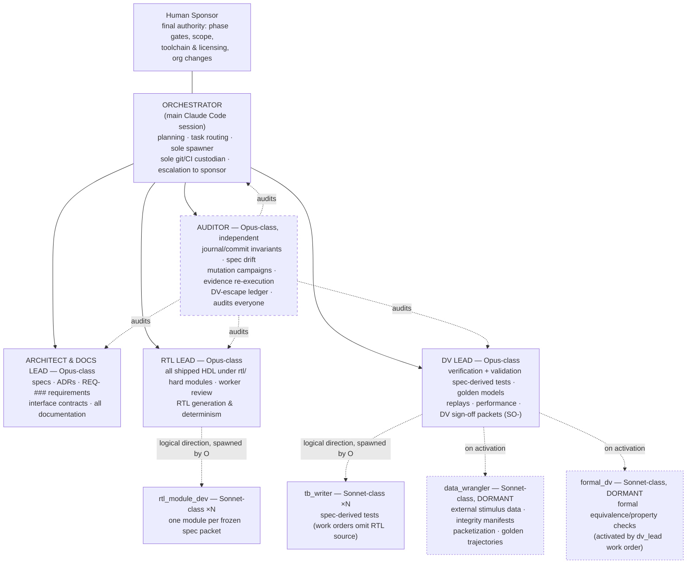

# Org Chart — Agent Organization

Every box below is an agent with a full, version-controlled charter in
[`agents/charters/`](agents/charters/) — open it to see exactly how that agent
operates: responsibilities, interfaces with every other agent, definition of
done, evaluation criteria, and escalation rules. Shared rules live in
[`agents/PROTOCOL.md`](agents/PROTOCOL.md). Every agent's reasoning is
preserved in its append-only journal in
[`agents/journals/`](agents/journals/), committed atomically with its work.

## Roster

| Agent | Model | Reports to | Charter | Journal | Status |
|---|---|---|---|---|---|
| `orchestrator` | main session | Human sponsor | [charter](agents/charters/orchestrator.md) | [journal](agents/journals/claude_orchestrator_agent.md) | Active (this session) |
| `architect_docs_lead` | opus | orchestrator | [charter](agents/charters/architect_docs_lead.md) | [journal](agents/journals/claude_architect_docs_lead_agent.md) | Seeded; first spawn after G0 intake |
| `rtl_lead` | opus | orchestrator | [charter](agents/charters/rtl_lead.md) | [journal](agents/journals/claude_rtl_lead_agent.md) | Seeded; first spawn after G0 intake |
| `dv_lead` | opus | orchestrator | [charter](agents/charters/dv_lead.md) | [journal](agents/journals/claude_dv_lead_agent.md) | Seeded; first spawn after G0 intake |
| `auditor` | opus | orchestrator → findings verbatim to sponsor | [charter](agents/charters/auditor.md) | [journal](agents/journals/claude_auditor_agent.md) | Seeded; first spawn after G0 intake |
| `rtl_module_dev` | sonnet (×N per WO) | rtl_lead (logical) | [charter](agents/charters/rtl_module_dev.md) | [journal](agents/journals/workers/claude_rtl_module_dev_agent.md) | Worker template (seeded) |
| `tb_writer` | sonnet (×N per WO) | dv_lead (logical) | [charter](agents/charters/tb_writer.md) | [journal](agents/journals/workers/claude_tb_writer_agent.md) | Worker template (seeded) |
| `data_wrangler` | sonnet | dv_lead (logical) | [charter](agents/charters/data_wrangler.md) | [journal](agents/journals/workers/claude_data_wrangler_agent.md) | DORMANT — activated by a dv_lead work order when the project needs external stimulus data |
| `formal_dv` | sonnet | dv_lead (logical) | [charter](agents/charters/formal_dv.md) | [journal](agents/journals/workers/claude_formal_dv_agent.md) | DORMANT — activated by a dv_lead work order when the project needs formal checks |

**Lessons duty (ADR-0012, ADR-0018)**: gate harvests, dedup, and the
landing of tier-1/2 entries into `docs/LESSONS.md` are orchestrator
work; the auditor owns the phase retrospective (PROTOCOL §7.1). Nothing
transmits between repositories — the file travels by hand.

Milestones: M0 bring-up (G0 intake, ratification, enforcement self-test) ·
M1 toolchain ADR + specs · M2+ set at G0 intake — roadmap in
[`tasks/BOARD.md`](tasks/BOARD.md). Contingent roles (e.g. a phase-scoped
second RTL lead) are activated per ADR-0001's contingent-role pattern, never
by pre-listing here.

## How the hierarchy actually executes

Claude Code subagents cannot spawn subagents, so solid arrows (spawning,
reporting) all terminate at the orchestrator, which is the **sole spawner and
sole git committer**. Dashed arrows are *logical* direction: a lead writes a
work order (`agents/handoffs/WO-*.md`), the orchestrator spawns the worker
with that packet, and the worker's output returns to the lead for review. The
chain of responsibility is reconstructible from packets, journals, and commit
trailers (`git log --grep 'Agent: <name>'`).

## Independence lines

- **DV is never graded by design**: dv_lead derives tests from specs, never
  RTL; tb_writer work orders omit RTL source; RTL-line agents cannot stage
  `test/` paths and DV-line agents cannot stage `rtl/` (mechanically
  enforced at commit time and in CI).
- **The auditor is graded only by the sponsor**: it audits everyone including
  the orchestrator, owns the DV-escape ledger, writes only to
  `docs/reports/audit/`, and never fixes what it finds. Its findings reach
  the sponsor unedited.
